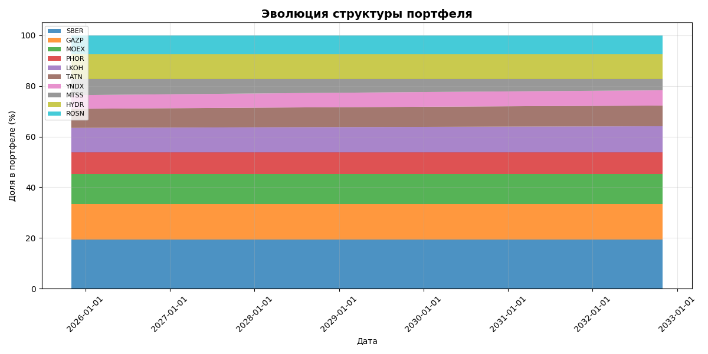
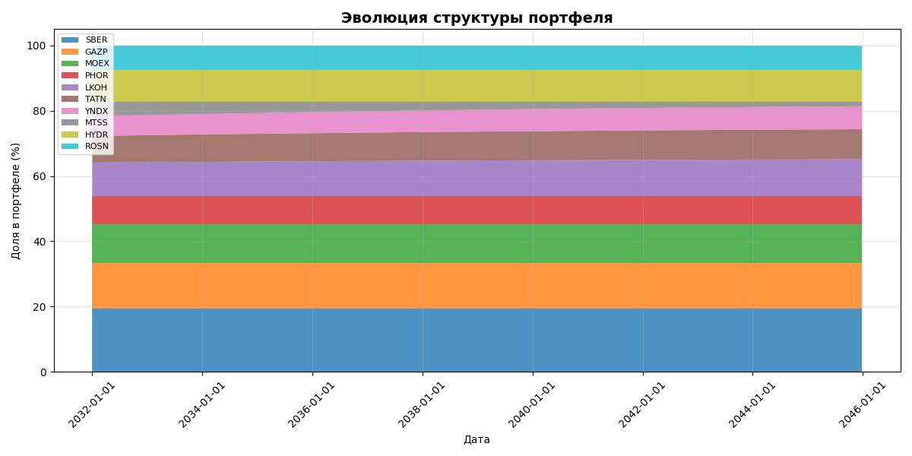
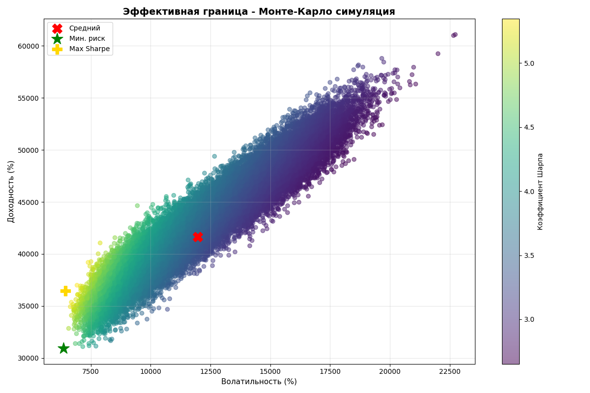
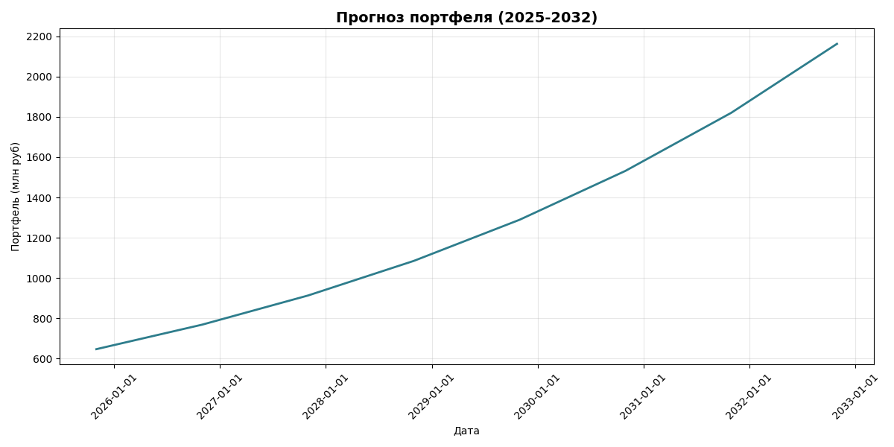
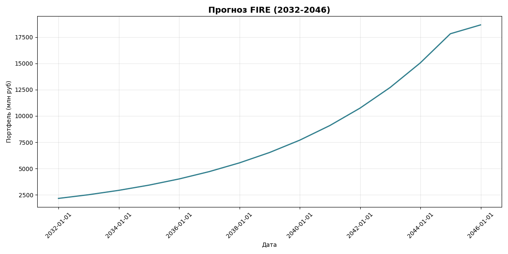

# Portfolio Optimization using Python

## Overview
This project develops an investment portfolio strategy for a private investor with a conservative risk profile. The analysis combines portfolio optimization methods, Monte Carlo simulation, and long-term capital forecasting.

## Project Goal
The goal of the project is to construct a balanced investment portfolio that provides stable long-term growth while maintaining an acceptable level of risk.

## Tools and Technologies
- Python  
- pandas  
- numpy  
- matplotlib  
- scipy  
- Excel  

## Methods
The project applies several quantitative finance methods:

- Markowitz portfolio optimization  
- Sharpe ratio maximization  
- Monte Carlo simulation  
- Scenario analysis  
- Portfolio diversification  

## Portfolio Structure
The final portfolio consists of:

- **60% equities**
- **40% bonds**

The stock component is diversified across several sectors:

- financial sector  
- energy  
- raw materials  
- telecommunications  
- IT  

## Key Results
- Initial capital: **656.6 million RUB**
- Portfolio growth was simulated under several scenarios
- Under the base scenario the portfolio exceeds **1.5 billion RUB within 7 years**

## Project Structure
data/ — input data for the portfolio
code/ — portfolio model implementation
presentation/ — project presentation
results/ — generated charts and portfolio visualizations

## Portfolio Visualization

### Portfolio Structure

### Efficient Frontier

### Portfolio Forecast

## My Contribution
This project was completed as part of a team assignment. I participated in the analytical work, preparation of the portfolio strategy, and presentation of the results.
